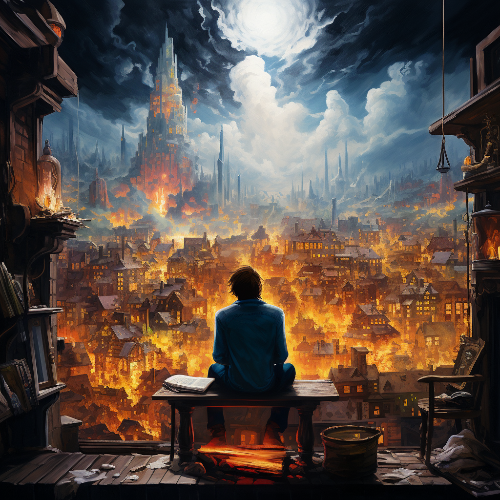

<h1>User Image Library</h1>

The User Image Library allows for users to store images to be pulled up later. The character limit on UVARs (As of 2/6/2024) is 10,000 characters. Check [here](https://github.com/avrae/avrae/blob/85b9ffdf4d70f0a9d9b9ab91b6a02f894766128e/aliasing/constants.py) for current values. Based upon the length of URLS created by Discord attachment URLs, this library allows for about 46 images. To be safe, I would not attempt to have any more than 30 images without any sort of URL shorteners.

[Table of Contents](https://github.com/Shadow-Draconic-Development/Avrae-User-Image-Library/blob/main/ToC.md)
[Shadow's Main Website](https://shadow-draconic-development.github.io/.github/)

## License Notice

This work includes material written by Seth Hartman (aka ShadowsStride) and is licensed under the Creative Commons Attribution 4.0 International License available at https://creativecommons.org/licenses/by/4.0/legalcode.

## Requests
Requests can be made at this [link.](https://forms.gle/YYkyPcBb1WHXWMYE6)

All requests can be viewed at this  [link.](https://docs.google.com/spreadsheets/d/1OyW78hh1ARDHeDu4hF4X2TxcpYSrrArprs8pkQB3zo4/edit?usp=sharing) All requests are viewable by all, if I have any problems I will restrict access to these links.

## Donations
You can click the button below to view my ko-fi and patreon page. Donations like this help me write more aliases and donators do get priority on feature requests.

 [Patreon](https://www.patreon.com/bePatron?u=47388431) 